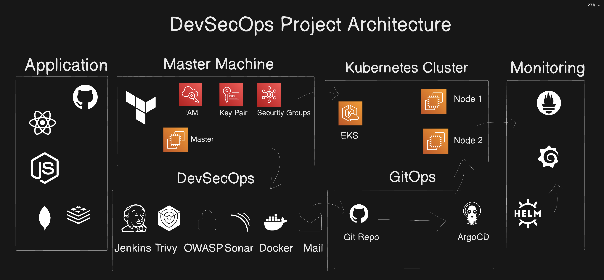

# DevSecOps CI/CD Pipeline with EKS Deployment using ArgoCD

A production ready Spring Boot banking application deployed on Amazon EKS with a complete CI/CD pipeline using Jenkins, ArgoCD, and comprehensive security scanning.

## Project Overview

This project demonstrates a complete DevSecOps implementation for a Spring Boot banking application, featuring:

**Application**: Spring Boot 3.3.3 banking application with MySQL database

**Container Orchestration**: Amazon EKS (Elastic Kubernetes Service)

**CI/CD Pipeline**: Jenkins with automated build, test, and deployment

**GitOps**: ArgoCD for automated Kubernetes deployments

**Security Scanning**: Trivy for container vulnerability scanning

**Infrastructure as Code**: Terraform for AWS infrastructure provisioning

**Monitoring**: Horizontal Pod Autoscaler (HPA) for auto scaling

## Architecture



### Technology Stack

| Category | Technology |
|----------|-----------|
| **Application** | Spring Boot 3.3.3, Java 17, Maven |
| **Database** | MySQL 8.0 |
| **Container** | Docker |
| **Container Registry** | DockerHub |
| **Orchestration** | Kubernetes (Amazon EKS) |
| **CI/CD** | Jenkins |
| **GitOps** | ArgoCD |
| **Security** | Trivy |
| **Infrastructure** | Terraform, AWS (EKS, EC2, EBS) |
| **Monitoring** | Kubernetes HPA, Metrics Server |

## Infrastructure Components

### AWS Resources
- **EKS Cluster**: `bankapp-cluster` in `eu-west-2`
- **Node Group**: 2 x t2.medium instances
- **EBS CSI Driver**: For persistent storage
- **VPC**: Default VPC configuration

### Kubernetes Resources
- **Namespace**: `bankapp-namespace`
- **Deployments**: BankApp (2 replicas), MySQL (1 replica)
- **Services**: ClusterIP for internal communication
- **ConfigMaps**: Application configuration
- **Secrets**: Database credentials
- **PersistentVolumeClaim**: 10Gi EBS volume for MySQL
- **HPA**: Auto-scaling from 2 to 5 replicas based on CPU (40% threshold)

## CI/CD Pipeline

### Jenkins Pipeline Stages

1. **Git Checkout**: Clone repository from GitHub
2. **Compile**: Maven clean compile
3. **Test**: Run unit tests (skipped in CI due to database dependency)
4. **Build Application**: Maven package (creates JAR)
5. **Build Docker Image**: Multi-stage Docker build
6. **Trivy Image Scan**: Security vulnerability scanning
7. **Push to DockerHub**: Push image with version tag
8. **Update Kubernetes Manifest**: Update deployment YAML with new image tag
9. **Commit & Push Changes**: Push updated manifest back to GitHub
10. **ArgoCD Auto-Sync**: ArgoCD detects changes and deploys to EKS

### Pipeline Features
- Automated versioning using Jenkins build number
- Security scanning with Trivy (HIGH and CRITICAL vulnerabilities)
- Docker multi-stage builds for optimized image size
- Automated manifest updates for GitOps workflow
- Automatic cleanup and docker logout

## Quick Start Guide

Want to replicate this entire DevSecOps pipeline? Follow these steps:

1. **Fork this repository** to your GitHub account
2. **Provision EC2 instance** using Terraform
3. **Create EKS cluster** with 2 node groups
4. **Install ArgoCD** on the cluster
5. **Install Jenkins** on EC2 instance
6. **Install Metrics Server** for auto-scaling
7. **Install NGINX Ingress** (optional, for external access)
8. **Configure Jenkins pipeline** with your repository
9. **Make code changes** and watch the magic happen!

Total setup time: **~45-60 minutes** (most is waiting for EKS cluster creation)

---

## Prerequisites

### Tools Required
- AWS CLI (configured with appropriate credentials)
- kubectl (v1.28+)
- eksctl (v0.167+)
- Terraform (v1.0+)
- Docker (v20.10+)
- Git

### AWS Permissions
- EKS cluster creation and management
- EC2 instance management
- EBS volume creation
- IAM role and policy management
- VPC networking

### Accounts Needed
- AWS Account with appropriate permissions
- DockerHub account (for pushing images)
- GitHub account (for forking repository)

## Complete Setup Instructions

### 1. Infrastructure Setup

#### Create EC2 Instance (via Terraform)
```bash
cd terraform
terraform init
terraform plan
terraform apply -auto-approve
```

#### SSH into EC2 Instance
```bash
ssh -i your-key.pem ubuntu@<EC2_PUBLIC_IP>
```

#### Install Required Tools
```bash
# AWS CLI
curl "https://awscli.amazonaws.com/awscli-exe-linux-x86_64.zip" -o "awscliv2.zip"
unzip awscliv2.zip
sudo ./aws/install

# kubectl
curl -LO "https://dl.k8s.io/release/$(curl -L -s https://dl.k8s.io/release/stable.txt)/bin/linux/amd64/kubectl"
chmod +x kubectl
sudo mv kubectl /usr/local/bin/

# eksctl
curl --silent --location "https://github.com/weaveworks/eksctl/releases/latest/download/eksctl_$(uname -s)_amd64.tar.gz" | tar xz -C /tmp
sudo mv /tmp/eksctl /usr/local/bin

# Docker
sudo apt update
sudo apt install -y docker.io
sudo systemctl start docker
sudo systemctl enable docker
```

### 2. Create EKS Cluster

```bash
eksctl create cluster \
  --name bankapp-cluster \
  --region eu-west-2 \
  --nodegroup-name bankapp-nodes \
  --node-type t2.medium \
  --nodes 2 \
  --nodes-min 2 \
  --nodes-max 3 \
  --managed
```

Wait approximately 15-20 minutes for cluster creation.

#### Enable IAM OIDC Provider
```bash
eksctl utils associate-iam-oidc-provider \
  --region=eu-west-2 \
  --cluster=bankapp-cluster \
  --approve
```

#### Install EBS CSI Driver
```bash
eksctl create iamserviceaccount \
  --name ebs-csi-controller-sa \
  --namespace kube-system \
  --cluster bankapp-cluster \
  --region eu-west-2 \
  --attach-policy-arn arn:aws:iam::aws:policy/service-role/AmazonEBSCSIDriverPolicy \
  --approve \
  --role-only \
  --role-name AmazonEKS_EBS_CSI_DriverRole

eksctl create addon \
  --name aws-ebs-csi-driver \
  --cluster bankapp-cluster \
  --region eu-west-2 \
  --service-account-role-arn arn:aws:iam::$(aws sts get-caller-identity --query Account --output text):role/AmazonEKS_EBS_CSI_DriverRole \
  --force
```

### 3. Install ArgoCD

```bash
kubectl create namespace argocd
kubectl apply -n argocd -f https://raw.githubusercontent.com/argoproj/argo-cd/stable/manifests/install.yaml

# Wait for ArgoCD pods to be ready
kubectl wait --for=condition=ready pod -l app.kubernetes.io/name=argocd-server -n argocd --timeout=300s

# Expose ArgoCD server
kubectl patch svc argocd-server -n argocd -p '{"spec": {"type": "LoadBalancer"}}'

# Get ArgoCD admin password
kubectl -n argocd get secret argocd-initial-admin-secret -o jsonpath="{.data.password}" | base64 -d
```

Access ArgoCD at the LoadBalancer URL with username `admin`.

#### Create ArgoCD Application
```bash
kubectl apply -f - <<EOF
apiVersion: argoproj.io/v1alpha1
kind: Application
metadata:
  name: bankapp
  namespace: argocd
spec:
  project: default
  source:
    repoURL: 'https://github.com/ArsalanAnwer0/Springboot-BankingApp.git'
    targetRevision: main
    path: kubernetes
  destination:
    server: 'https://kubernetes.default.svc'
    namespace: bankapp-namespace
  syncPolicy:
    automated:
      prune: true
      selfHeal: true
    syncOptions:
      - CreateNamespace=true
EOF
```

### 4. Install Jenkins

```bash
# Install Java
sudo apt update
sudo apt install -y fontconfig openjdk-17-jre openjdk-17-jdk

# Install Jenkins
sudo wget -O /usr/share/keyrings/jenkins-keyring.asc \
  https://pkg.jenkins.io/debian-stable/jenkins.io-2023.key
echo "deb [signed-by=/usr/share/keyrings/jenkins-keyring.asc]" \
  https://pkg.jenkins.io/debian-stable binary/ | sudo tee \
  /etc/apt/sources.list.d/jenkins.list > /dev/null
sudo apt-get update
sudo apt-get install -y jenkins

# Start Jenkins
sudo systemctl start jenkins
sudo systemctl enable jenkins

# Get initial admin password
sudo cat /var/lib/jenkins/secrets/initialAdminPassword
```

Access Jenkins at `http://<EC2_PUBLIC_IP>:8080`

#### Install Jenkins Plugins
- Maven Integration
- Docker Pipeline
- Docker
- Git
- Kubernetes CLI

#### Configure Jenkins Tools
1. **JDK**:
   - Name: `jdk17`
   - JAVA_HOME: `/usr/lib/jvm/java-17-openjdk-amd64`

2. **Maven**:
   - Name: `maven3`
   - MAVEN_HOME: `/usr/share/maven`

#### Add Jenkins Credentials
1. **GitHub** (ID: `github`): Username with password/token
2. **DockerHub** (ID: `dockerhub`): Username with password

#### Configure Docker Permissions
```bash
sudo usermod -aG docker jenkins
sudo systemctl restart jenkins
```

#### Create Jenkins Pipeline Job

1. Open Jenkins UI at `http://<EC2_PUBLIC_IP>:8080`
2. Click "New Item" → Enter name (e.g., "bankapp-pipeline") → Select "Pipeline"
3. Under "Pipeline" section:
   - Definition: "Pipeline script from SCM"
   - SCM: Git
   - Repository URL: `https://github.com/YOUR_USERNAME/Springboot-BankingApp.git`
   - Branch: `*/main`
   - Script Path: `Jenkinsfile`
4. Click "Save"

### 5. Install Metrics Server

The Metrics Server is required for Horizontal Pod Autoscaler (HPA) to work.

```bash
kubectl apply -f https://github.com/kubernetes-sigs/metrics-server/releases/latest/download/components.yaml

# Verify installation
kubectl get deployment metrics-server -n kube-system
```

### 6. Install NGINX Ingress Controller (Optional)

If you want external access via domain/LoadBalancer:

```bash
kubectl apply -f https://raw.githubusercontent.com/kubernetes/ingress-nginx/controller-v1.8.2/deploy/static/provider/aws/deploy.yaml

# Wait for LoadBalancer to be provisioned
kubectl get svc ingress-nginx-controller -n ingress-nginx --watch

# Get LoadBalancer URL
kubectl get svc ingress-nginx-controller -n ingress-nginx -o jsonpath='{.status.loadBalancer.ingress[0].hostname}'
```

#### Update Ingress Manifest

Update `kubernetes/bankapp-ingress.yml` with your LoadBalancer IP:
```yaml
spec:
  rules:
  - host: bankapp.<LOADBALANCER_IP>.nip.io
```

Then apply:
```bash
kubectl apply -f kubernetes/bankapp-ingress.yml
```

### 7. Install Security Tools

```bash
# Install Trivy
sudo apt-get install -y wget apt-transport-https gnupg lsb-release
wget -qO - https://aquasecurity.github.io/trivy-repo/deb/public.key | sudo apt-key add -
echo "deb https://aquasecurity.github.io/trivy-repo/deb $(lsb_release -sc) main" | sudo tee -a /etc/apt/sources.list.d/trivy.list
sudo apt-get update
sudo apt-get install -y trivy
```

### 8. Update Configuration Files

Before running the pipeline, update these files with your information:

1. **Jenkinsfile**: Update DockerHub username
   ```groovy
   DOCKER_IMAGE = 'YOUR_DOCKERHUB_USERNAME/bankapp-eks'
   ```

2. **kubernetes/bankapp-deployment.yml**: Update image name
   ```yaml
   image: YOUR_DOCKERHUB_USERNAME/bankapp-eks:v1
   ```

3. **ArgoCD Application** (if created manually): Update repo URL
   ```yaml
   repoURL: 'https://github.com/YOUR_USERNAME/Springboot-BankingApp.git'
   ```

## Deployment

### Deploy via ArgoCD (GitOps)

1. Push changes to GitHub repository
2. ArgoCD automatically syncs and deploys to EKS

### Manual Deployment

```bash
# Apply Kubernetes manifests
kubectl apply -f kubernetes/bankapp-namespace.yml
kubectl apply -f kubernetes/configmap.yml
kubectl apply -f kubernetes/mysql-secret.yml
kubectl apply -f kubernetes/persistent-volume-claim.yml
kubectl apply -f kubernetes/mysql-deployment.yml
kubectl apply -f kubernetes/mysql-service.yml

# Wait for MySQL to be ready
kubectl wait --for=condition=ready pod -l app=mysql -n bankapp-namespace --timeout=300s

# Deploy application
kubectl apply -f kubernetes/bankapp-deployment.yml
kubectl apply -f kubernetes/bankapp-service.yml
kubectl apply -f kubernetes/bankapp-hpa.yml
```

## Verification

### Check Deployments
```bash
kubectl get all -n bankapp-namespace
```

### Check ArgoCD Application
```bash
kubectl get application bankapp -n argocd
```

### View Application Logs
```bash
kubectl logs -f deployment/bankapp-deploy -n bankapp-namespace
```

### Test Application
```bash
kubectl run test-pod --rm -it --image=curlimages/curl:latest --restart=Never -n bankapp-namespace -- curl http://bankapp-service:8080
```

## CI/CD Workflow

### Triggering a Build

1. Make code changes in your repository
2. Commit and push to GitHub
3. Jenkins pipeline automatically triggers
4. Pipeline builds, tests, scans, and pushes Docker image
5. Pipeline updates Kubernetes manifest with new image tag
6. ArgoCD detects change and deploys to EKS
7. Rolling update replaces old pods with new ones

### Monitoring Pipeline

- **Jenkins Dashboard**: View build status and logs
- **ArgoCD UI**: Monitor deployment status and health
- **Kubernetes**: Check pod status and logs

## Security Features

### Container Security
- **Trivy Scanning**: Scans Docker images for vulnerabilities
- **Severity Filtering**: Focuses on HIGH and CRITICAL vulnerabilities
- **Automated Scanning**: Every build is scanned before deployment

### Kubernetes Security
- **Secrets Management**: Database credentials stored in Kubernetes Secrets
- **Resource Limits**: CPU and memory limits defined for all containers
- **Health Checks**: Readiness and liveness probes configured
- **Network Policies**: ClusterIP services for internal communication

### Best Practices
- Multi stage Docker builds for smaller attack surface
- Non root containers where possible
- Regular security updates via automated CI/CD
- Infrastructure as Code for reproducible environments

## Monitoring and Scaling

### Horizontal Pod Autoscaler (HPA)
```yaml
minReplicas: 2
maxReplicas: 5
targetCPUUtilizationPercentage: 40
```

HPA automatically scales the application based on CPU utilization.

### Metrics Server
Required for HPA functionality. Already installed with EKS.

### Checking HPA Status
```bash
kubectl get hpa -n bankapp-namespace
kubectl describe hpa bankapp-hpa -n bankapp-namespace
```

## Troubleshooting

### Pipeline Fails at Docker Build
- Verify Jenkins user is in docker group: `groups jenkins`
- Restart Jenkins: `sudo systemctl restart jenkins`

### ArgoCD Not Syncing
- Check application status: `kubectl get application bankapp -n argocd`
- Force sync: `kubectl patch application bankapp -n argocd --type merge -p '{"operation":{"initiatedBy":{"username":"admin"},"sync":{"revision":"HEAD"}}}'`

### Pods Not Starting
- Check logs: `kubectl logs <pod-name> -n bankapp-namespace`
- Describe pod: `kubectl describe pod <pod-name> -n bankapp-namespace`
- Verify PVC is bound: `kubectl get pvc -n bankapp-namespace`

### MySQL Connection Issues
- Verify MySQL pod is running: `kubectl get pods -l app=mysql -n bankapp-namespace`
- Check MySQL logs: `kubectl logs -l app=mysql -n bankapp-namespace`
- Verify service: `kubectl get svc mysql-service -n bankapp-namespace`

## Project Structure

```
.
├── kubernetes/                 # Kubernetes manifests
│   ├── bankapp-deployment.yml # BankApp deployment
│   ├── bankapp-service.yml    # BankApp service
│   ├── bankapp-hpa.yml        # Horizontal Pod Autoscaler
│   ├── bankapp-namespace.yml  # Namespace definition
│   ├── configmap.yml          # Application configuration
│   ├── mysql-secret.yml       # MySQL credentials
│   ├── mysql-deployment.yml   # MySQL deployment
│   ├── mysql-service.yml      # MySQL service
│   └── persistent-volume-claim.yml # MySQL PVC
├── terraform/                 # Terraform IaC
│   └── main.tf               # EC2 instance configuration
├── Dockerfile                 # Multi stage Docker build
├── Jenkinsfile               # Jenkins pipeline definition
├── pom.xml                   # Maven project configuration
└── src/                      # Spring Boot application source
```

## Key Kubernetes Manifests

### BankApp Deployment
- **Replicas**: 2 (high availability)
- **Image**: arsalananwer0/bankapp-eks (auto-updated by pipeline)
- **Resources**: 512Mi-1Gi memory, 250m-500m CPU
- **Health Checks**: Readiness (30s delay) and Liveness (60s delay) probes

### MySQL Deployment
- **Storage**: 10Gi EBS volume
- **StorageClass**: gp2 (AWS EBS)
- **Credentials**: Stored in Kubernetes Secret

## Security Note

This is a demonstration project for educational purposes. The credentials and secrets included in this repository (such as Kubernetes secrets, database passwords) are for development and testing only. For production deployments:

- Use proper secret management solutions (AWS Secrets Manager, HashiCorp Vault)
- Never commit credentials or private keys to version control
- Use environment variables for sensitive configuration
- Implement proper RBAC and network policies
- Enable CSRF protection and security headers

## License

This project is for educational and demonstration purposes.
