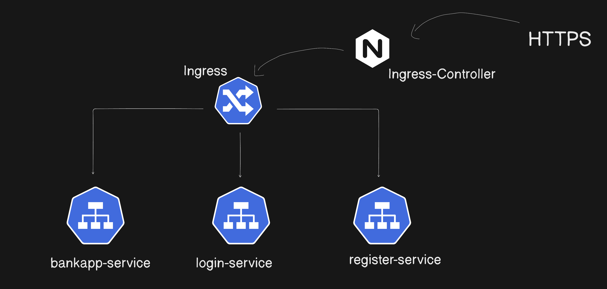

# Kubernetes Deployment Guide

## Ingress Architecture



The application uses NGINX Ingress Controller to route external HTTP/HTTPS traffic to the banking application services running in the Kubernetes cluster.

## Prerequisites

Before deploying the application with Ingress and HPA, you need to install:

### 1. Metrics Server (Required for HPA)
```bash
kubectl apply -f https://github.com/kubernetes-sigs/metrics-server/releases/latest/download/components.yaml
```

### 2. NGINX Ingress Controller (Required for Ingress)
```bash
kubectl apply -f https://raw.githubusercontent.com/kubernetes/ingress-nginx/controller-v1.8.1/deploy/static/provider/aws/deploy.yaml
```

### 3. cert-manager (Required for Let's Encrypt TLS)
```bash
kubectl apply -f https://github.com/cert-manager/cert-manager/releases/download/v1.13.0/cert-manager.yaml
```

## Deployment Order

### Option 1: Deploy Everything (with Ingress)

```bash
# 1. Core resources
kubectl apply -f bankapp-namespace.yml
kubectl apply -f configmap.yml
kubectl apply -f mysql-secret.yml

# 2. Storage
kubectl apply -f persistent-volume-claim.yml

# 3. MySQL
kubectl apply -f mysql-deployment.yml
kubectl apply -f mysql-service.yml

# 4. Wait for MySQL to be ready (important!)
kubectl wait --for=condition=ready pod -l app=mysql -n bankapp-namespace --timeout=300s

# 5. BankApp
kubectl apply -f bankapp-deployment.yml
kubectl apply -f bankapp-service.yml

# 6. HPA (requires metrics-server)
kubectl apply -f bankapp-hpa.yml

# 7. Ingress (requires nginx-ingress-controller and cert-manager)
kubectl apply -f letsencrypt-clusterissuer.yml
kubectl apply -f bankapp-ingress.yml
```

### Option 2: Deploy Without Ingress (Quick Start)

```bash
# 1. Core resources
kubectl apply -f bankapp-namespace.yml
kubectl apply -f configmap.yml
kubectl apply -f mysql-secret.yml

# 2. Storage
kubectl apply -f persistent-volume-claim.yml

# 3. MySQL
kubectl apply -f mysql-deployment.yml
kubectl apply -f mysql-service.yml

# 4. Wait for MySQL
kubectl wait --for=condition=ready pod -l app=mysql -n bankapp-namespace --timeout=300s

# 5. BankApp
kubectl apply -f bankapp-deployment.yml
kubectl apply -f bankapp-service.yml

# 6. Expose via LoadBalancer (skip ingress)
kubectl patch svc bankapp-service -n bankapp-namespace -p '{"spec": {"type": "LoadBalancer"}}'
```

## Ingress Configuration

Before applying the ingress:

1. **Update the domain** in `bankapp-ingress.yml`:
   - Change `megaproject.trainwithshubham.com` to your domain

2. **Update the email** in `letsencrypt-clusterissuer.yml`:
   - Change `trainwithshubham@gmail.com` to your email

3. **Point your domain** to the ingress load balancer:
   ```bash
   # Get the load balancer address
   kubectl get svc -n ingress-nginx ingress-nginx-controller

   # Create an A record pointing your domain to this address
   ```

## Verification Commands

```bash
# Check all resources
kubectl get all -n bankapp-namespace

# Check pods
kubectl get pods -n bankapp-namespace

# Check services
kubectl get svc -n bankapp-namespace

# Check ingress
kubectl get ingress -n bankapp-namespace

# Check HPA
kubectl get hpa -n bankapp-namespace

# View logs
kubectl logs -f deployment/bankapp-deploy -n bankapp-namespace
kubectl logs -f deployment/mysql -n bankapp-namespace

# Get LoadBalancer URL (if using LoadBalancer service)
kubectl get svc bankapp-service -n bankapp-namespace -o jsonpath='{.status.loadBalancer.ingress[0].hostname}'
```

## Troubleshooting

### MySQL pod not starting
```bash
kubectl describe pod -l app=mysql -n bankapp-namespace
kubectl logs -l app=mysql -n bankapp-namespace
```

### BankApp pod not starting
```bash
kubectl describe pod -l app=bankapp-deploy -n bankapp-namespace
kubectl logs -l app=bankapp-deploy -n bankapp-namespace
```

### Ingress not working
```bash
# Check ingress controller
kubectl get pods -n ingress-nginx

# Check ingress resource
kubectl describe ingress bankapp-ingress -n bankapp-namespace

# Check cert-manager
kubectl get pods -n cert-manager
kubectl get certificate -n bankapp-namespace
```

### HPA not working
```bash
# Check metrics-server
kubectl get pods -n kube-system | grep metrics-server

# Check HPA status
kubectl describe hpa bankapp-hpa -n bankapp-namespace
```

## Storage Notes

- Uses AWS EBS (`gp2`) storage class
- 10Gi volume for MySQL data
- Data persists across pod restarts
- Volume is in the same availability zone as the pod

## Security Considerations

1. **Change default MySQL password** in `mysql-secret.yml` before production use
2. **Update email address** in `letsencrypt-clusterissuer.yml`
3. **Update domain name** in `bankapp-ingress.yml`
4. Consider using AWS Secrets Manager or external secrets operator for production
